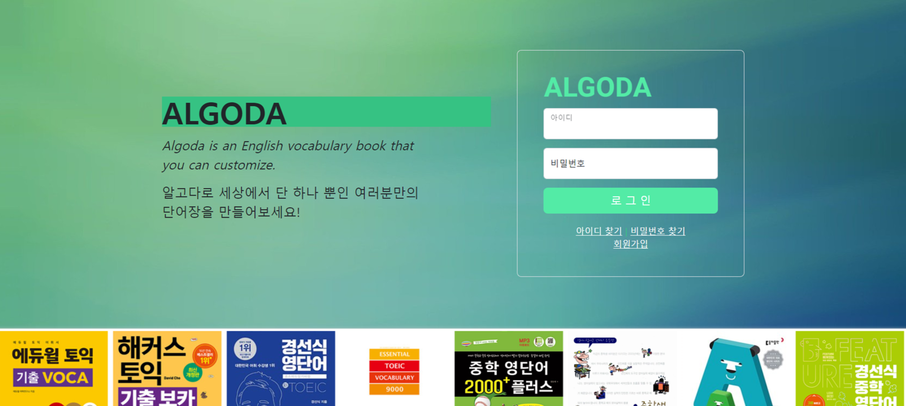
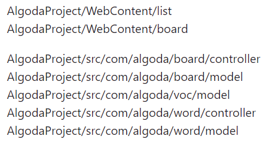

# 나만의 단어장 사이트

## 프로젝트 간단 소개

JAVA 국비과정 수료 프로젝트로 4명의 조원과 함께 만든 웹 페이지 입니다. 프로젝트를 하면서 
Spring Framework 의 형식을 좀 더 이해하기 위해 MVC 모델 구조로 설계한 특징이 있습니다.

### **사용한 언어/툴**

- 언어
: JAVA / JSP / HTML / CSS / JS / SQL
- Tool
: Visual Studio / SQL Developer / AWS

---

## 사이트 기능

프로그램의 주요 기능들은 다음과 같으며 저는 이중 ‘**단어장 기능 , 게시판 기능**’을 담당 하였고 조원들의 진행사항을 감독하고 파일들을 종합하는 조장 역할을 수행 하였습니다 .

- 회원 관련 기능
:  회원 가입 (유효성 검사) / 아이디 찾기(힌트) / 비밀번호 찾기(임시 비밀번호 이메일 전송)
- 단어장 기능
: Level별 Day 별 단어를 표현 / 선택에 따라 ‘나만의 단어장’에 추가
- 게시판 기능
:  건의사항을 올리는 간단한 게시판
- 단어장 관리(관리자) 기능
: 단어장의 단어를 직접 편집
- 단어 복습 기능
: 퀴즈를 통해 단어를 복습 / 채점 결과를 확인한 후 나만의 단어장 추가

---

## DB 설계

---

## 담당화면(기능) 소개

제가 담당 한 **단어장 기능 , 게시판 기능** 관련 해서는 아래 디렉터리 주소들의 파일에 해당 합니다.

프로젝트의 전체적인 파일들이 MVC 구조를 갖다 보니 Controller 파일에

- `~/WebContent/~` 디렉터리 파일
:  JSP 파일 , Img 파일과 같은 MVC 구조의 View 부분에 해당하여 프로젝트의 UI 화면을 구성
- `~/Model`디렉터리 파일
:  MVC 구조의 Model 부분에 해당하고  프로젝트 내  DB와 상호작용하는 비즈니스 로직.
JDBC 를 이용한 SQL Query 조작을 통해 DB 접근
- `~/controller` 디렉터리 파일
:  MVC 구조의 Controller 부분에 해당하고 프로젝트의 Model 과 View 사이 상호작용.
Query Parameter , `HttpServletRequest`,`HttpServletResponse` , `HttpSession`를 이용하여 
Model 과 View 사이에 data를 전달하고 처리하는 형식

---

## 담당기능 실행 화면

### **단어장 기능** 

### **나만의 단어장 기능**

### **게시판 기능**

---
